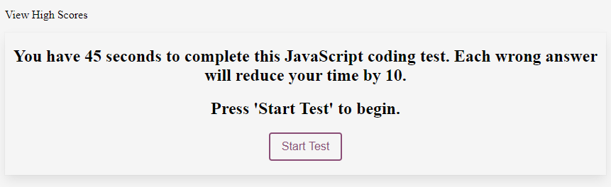
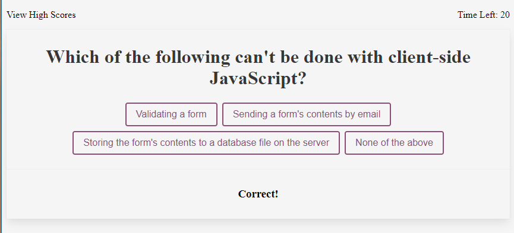
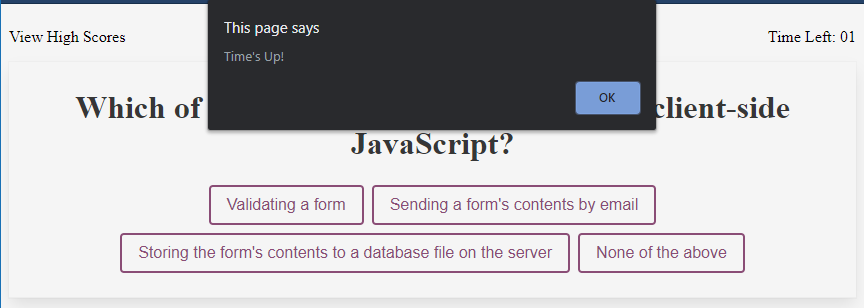
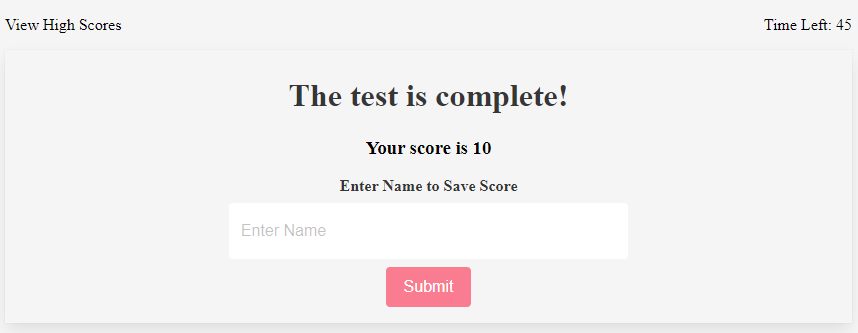
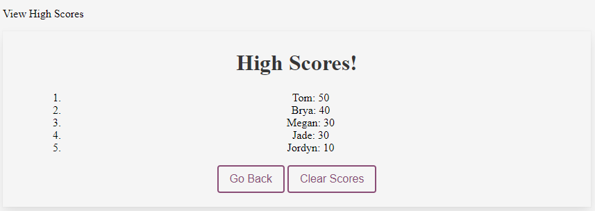

# bootcamp-week4-hw
Code Quiz

This is a javascript coding quiz consisting of five questions. When the user hits the "Start Test" button, the first question is displayed, and a timer for 45 seconds begins. 

 Once an answer is selected, the result is displayed temporarily at the bottom of the next question.

When the user selects an incorrect answer, the time will be reduced by 10 seconds. When the user runs out of time, an alert appears. 

After the user selects "OK" on the alert, or when the user completes all questions, their score will be revealed, and the user will be allowed to submit their score. 

The high scores will be displayed in order, highest on top, automatically after saving the score. High scores can also be viewed by clicking the "View High Scores" text in the upper left corner 

The user has the option to "Go Back" and take the test again, or to clear out all the high scores. 
